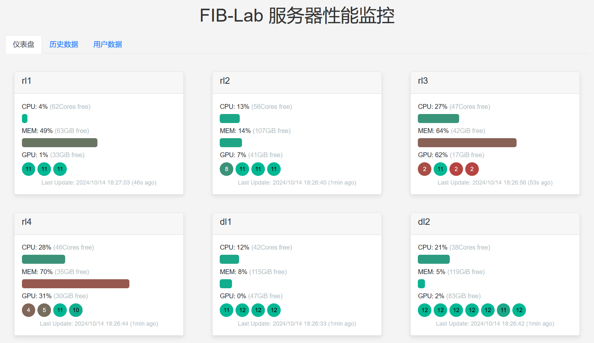
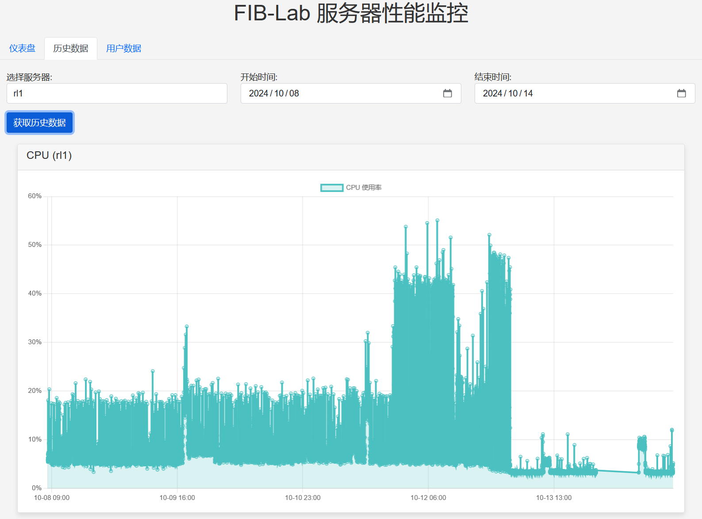
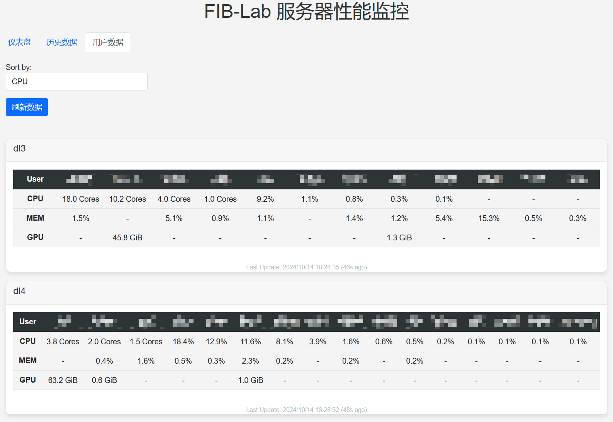

# FIB-Lab Server Monitor

This is a simple server monitor that can monitor the CPU and memory usage, as well as CUDA memory usage of servers, and display the results in a web page.

## Monitor Server Usage
1. Create `hosts.yml`
```
my_host1: # corresponding to `ssh johnDoe@host1.example.com`
  allow_agent: true
  hostname: host1.example.com
  username: johnDoe
my_host2:
  allow_agent: true
  hostname: host2.example.com
  username: johnDoe
```
2. Then run
```
python monitor.py
```
It will link to the hosts in `hosts.yml` and monitor the CPU and memory usage, as well as CUDA memory of the hosts. The results will be stored in `data/{host}.json`, each line of which is a JSON object representing the usage at a certain time.

## Create a Web Server

1. We use FastAPI, so you have to install it first:
```
pip install fastapi uvicorn
```
2. (optional) You can create a `mapping.json` to map the usernames into their real names. For example:
```
{
    "root": "Root User",
    "johnDoe": "John Doe",
    "janeDoe": "Jane Doe"
}
```
3. Then run
```
uvicorn main:app --host 0.0.0.0 --port 8000
```
This will create a web server at `http://localhost:8000` that shows the usage of the hosts in `hosts.yml`. It will also generates a document at `http://localhost:8000/docs` that shows the API documentation.

## Demo

If you are in the Tsinghua campus, you can access our demo server at [https://monitor.yumeow.site](https://monitor.yumeow.site).. We also provide some snapshots of the demo server as follows:





