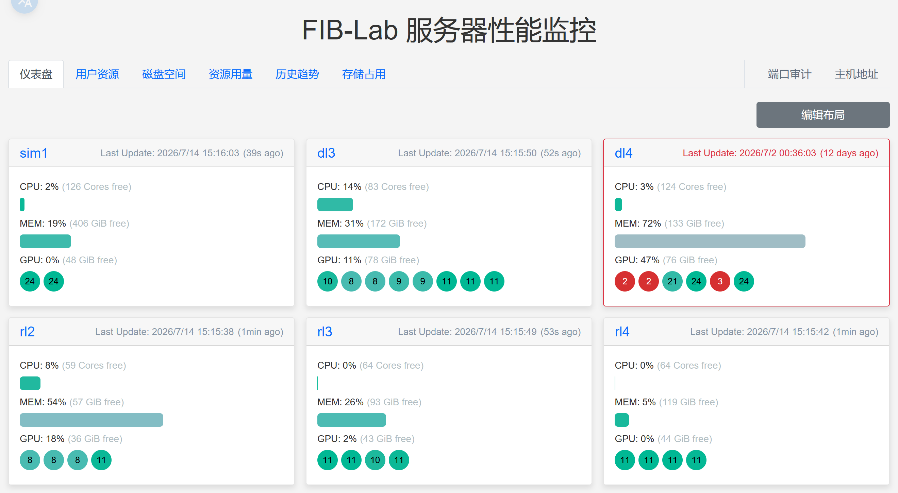
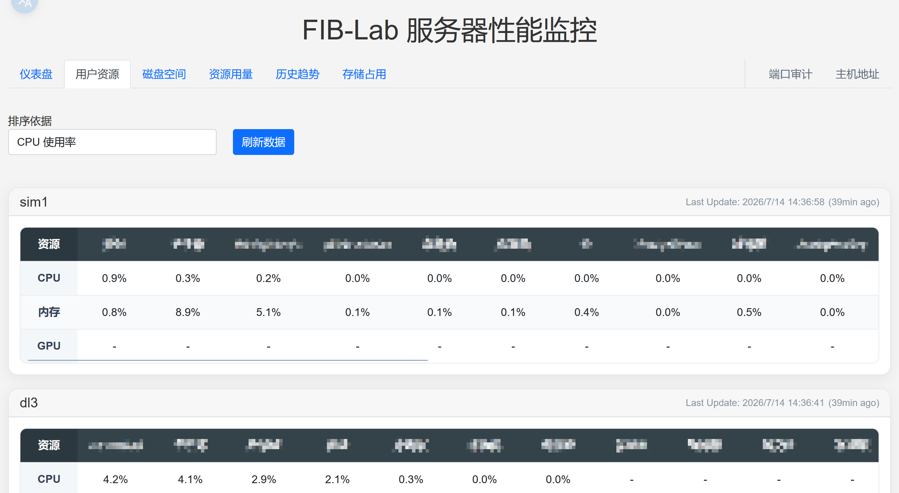
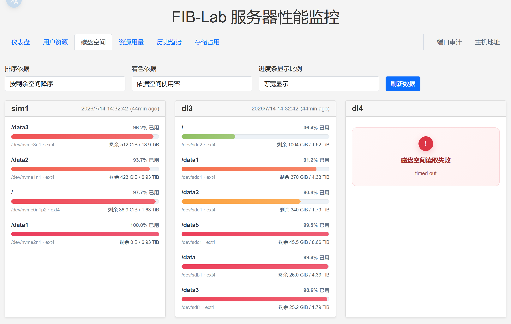
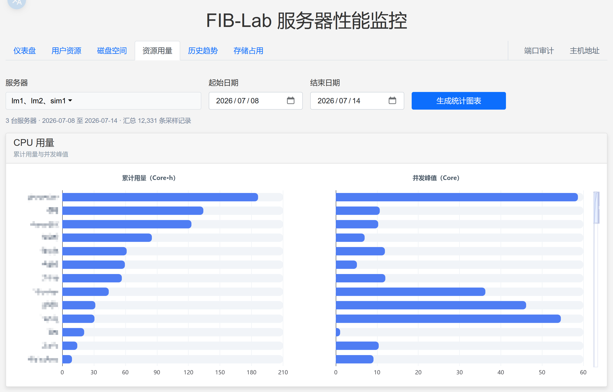
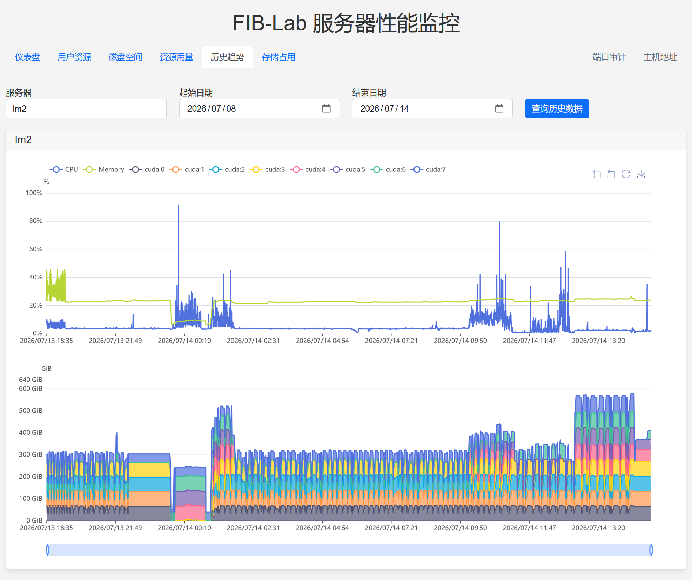
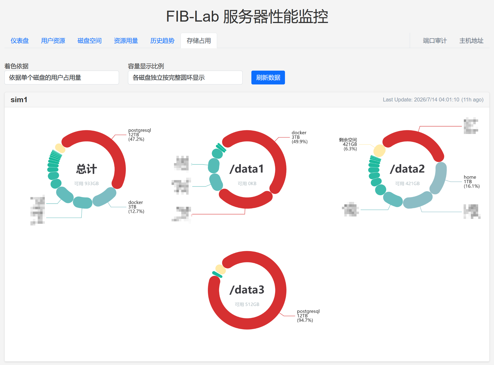

# FIB-Lab Server Monitor

面向实验室多服务器环境的轻量级资源监控平台。系统通过 SSH 定期采集 CPU、内存和 GPU 数据，按主机与年份写入 SQLite，并通过 Web 界面提供实时状态、历史趋势、跨服务器用量统计和存储空间查询。



## 功能概览

- **仪表盘**：集中展示各服务器当前的 CPU、内存与 GPU 显存状态。
- **用户资源**：查看各用户当前占用的 CPU、内存和显存；可选用中文名称展示用户。
- **磁盘空间**：实时执行远端 `df`，以卡片和进度条展示各文件系统的容量与剩余空间。
- **资源用量**：选择多台服务器与时间范围，流式统计每位用户的累计用量和峰值用量。
- **历史趋势**：流式读取较长时间范围内的 CPU、内存与各 GPU 使用曲线。
- **存储占用**：展示远端预先生成的用户目录占用统计。
- **端口审计**：经 TOTP 验证后，使用独立管理员私钥查询监听端口、PID 与进程信息。
- **主机地址**：经 TOTP 验证后查询各服务器的解析地址。

| 用户资源 | 磁盘空间 |
| --- | --- |
|  |  |

| 资源用量 | 历史趋势 |
| --- | --- |
|  |  |



## 工作方式

`collector.py` 为每台服务器启动独立采集线程，并将快照保存到：

```text
data/{host}/{year}.db
```

`web_server.py` 提供 FastAPI 接口和静态前端。两个进程共享 `data/`、`config/` 与 `log/`，可以由 Docker Compose 一并运行。

## 快速部署

### 1. 准备配置

```bash
cp config/hosts.example.yml config/hosts.yml
mkdir -p data log
```

编辑 `config/hosts.yml`：

```yaml
server1:
  hostname: server1.example.com
  port: 22
  username: monitor
  allow_agent: true
```

采集账户需要能够读取系统负载、进程、内存、GPU 和文件系统信息。若需通过跳板机连接，可增加 `jumper`：

```yaml
server1:
  hostname: 192.168.1.20
  port: 22
  username: monitor
  allow_agent: true
  jumper:
    hostname: gateway.example.com
    port: 22
    username: monitor
    allow_agent: true
```

用户名映射是可选配置。不创建 `config/mapping.json` 时，界面直接显示系统用户名；如需映射，可执行：

```bash
cp config/mapping.example.json config/mapping.json
```

文件格式如下：

```json
{
  "alice": "张三",
  "bob": "李四"
}
```

### 2. 启动服务

```bash
docker compose up -d --build
```

默认监听 `http://127.0.0.1:9805`。对外发布时，建议使用 HTTPS 反向代理。

> 项目不会读取 `.env` 文件。若需要管理员功能，请在启动 Compose 前通过 shell 或部署平台设置 `TOTP_SECRET`。

## 管理员功能

生成 TOTP Base32 密钥：

```bash
python -c "import pyotp; print(pyotp.random_base32())"
export TOTP_SECRET='生成的密钥'
docker compose up -d
```

未设置 `TOTP_SECRET` 时，普通监控功能不受影响，管理员接口返回 `503`。

端口审计还需要一把能够登录目标服务器的独立管理员 SSH 私钥。在 `docker-compose.yml` 中取消对应挂载的注释并修改宿主机路径：

```yaml
- /path/to/admin/id_rsa:/run/secrets/servermonitor_admin_ssh_key:ro
```

未挂载该私钥时，端口审计不可用。请为私钥设置严格权限，并避免与日常登录密钥共用。

## 统计口径

累计资源用量按相邻样本的时间差积分，而不是直接累加采样值：

```text
累计用量 += 当前样本值 × 相邻样本时间差
```

CPU 的累计单位为 Core·h，内存与显存的累计单位为 GiB·h。相邻样本间隔超过 5 分钟时，该区间不计入累计值，避免采集服务中断后将旧状态外推到整个空档期。

## 项目结构

```text
collector.py                 数据采集入口
web_server.py                Web 服务入口
config/                      主机配置、可选用户名映射及示例
data/{host}/{year}.db        SQLite 历史数据
src/monitor/                 CPU、内存和 GPU 采集模块
src/utils/                   SSH 与日志工具
src/web/                     Web 辅助代码与前端资源
```

## 本地运行

需要 Python 3.13，以及远端常见 Linux 工具 `top`、`ps`、`df` 和 `nproc`；GPU 采集还需要 `nvidia-smi`。

```bash
python -m pip install -r requirements.txt
python collector.py
```

另开一个终端启动 Web 服务：

```bash
uvicorn web_server:app --host 127.0.0.1 --port 8000
```

## 数据与安全

- `data/` 中的 SQLite 数据可能包含用户名和进程资源信息，不应公开。
- `config/hosts.yml`、`config/mapping.json`、SSH 私钥与本地日志均被 Git 和 Docker 构建上下文排除。
- 建议定期备份 `data/`，并在升级或迁移前验证备份可恢复。
- 管理员 TOTP 通过 `X-TOTP-Code` 请求头传递，避免出现在 URL 和常规访问日志中。

## 发布前检查

```bash
python -m compileall -q web_server.py collector.py src
node --check src/web/templates/js/dashboard.js
node --check src/web/templates/js/history.js
node --check src/web/templates/js/usage.js
docker compose config
git diff --check
```
